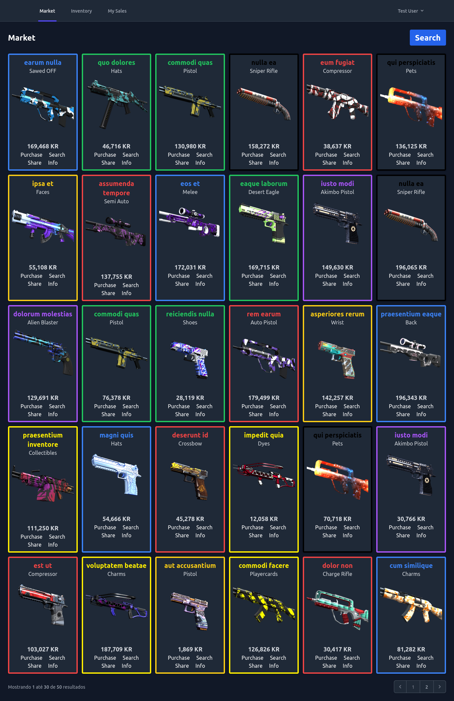
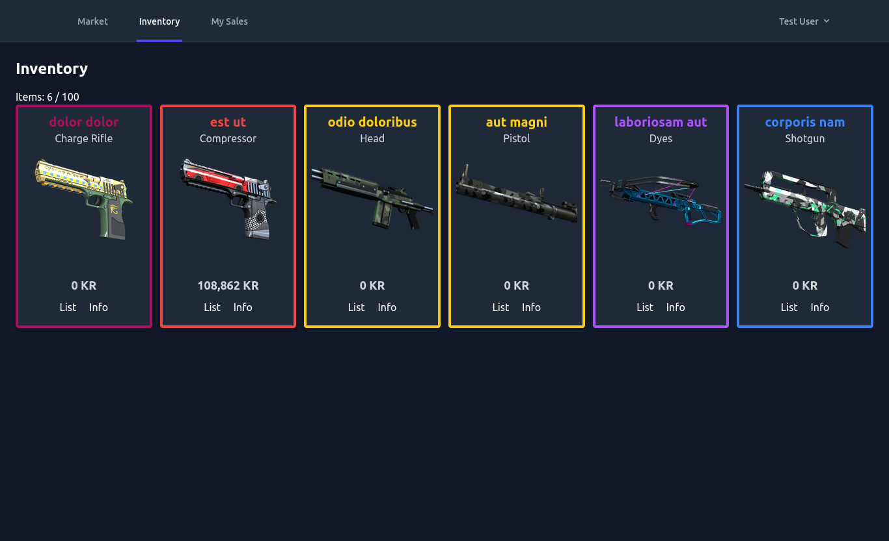
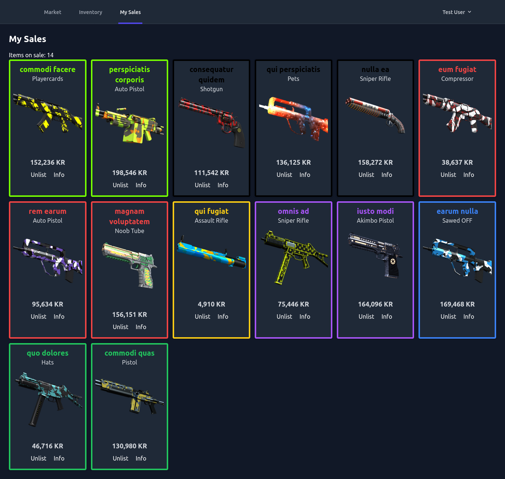
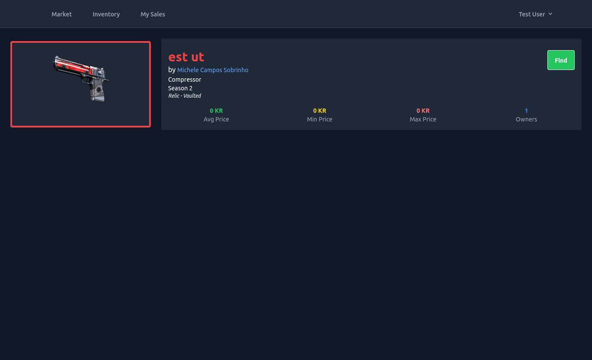
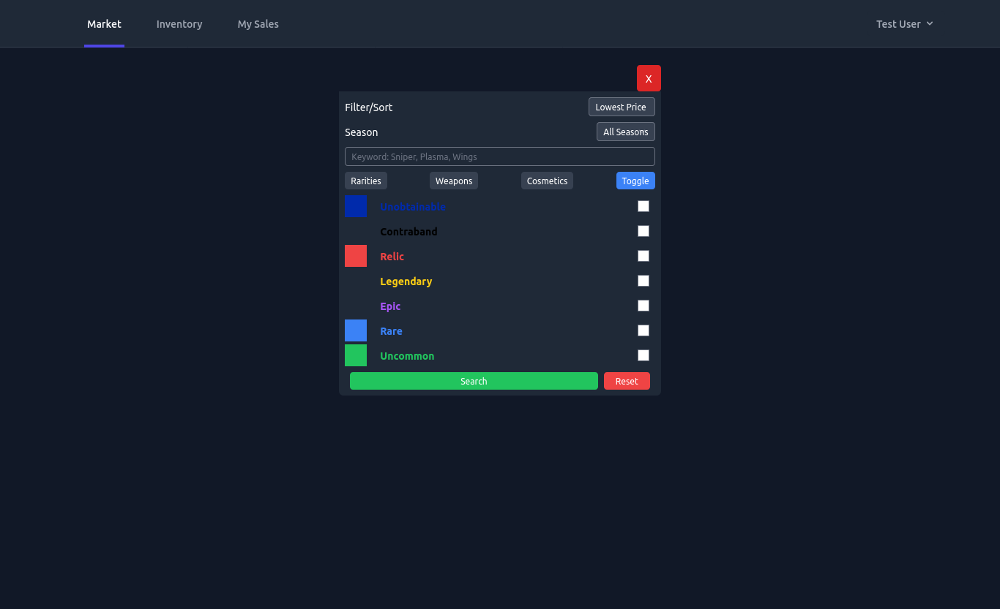

# Krunker Hub (Clone)

Este projeto é um **clone funcional de um marketplace de skins do jogo Krunker**, denominado [Krunker Hub](https://krunker.io/social.html), desenvolvido com o objetivo de **praticar e aprofundar meus conhecimentos** em **Laravel**, **Livewire** e **Tailwind CSS**.

A proposta é simular a plataforma onde jogadores podem visualizar, listar e negociar skins, replicando funcionalidades essenciais de um ambiente de compra e venda — como **sistema de inventário**, **listagem de itens no mercado**, **gestão de vendas**, **troca de skins**, **visualização de informações de perfil**, etc.

Além de servir como um projeto de aprendizado, esse sistema também busca demonstrar boas práticas de arquitetura com Laravel, uso eficiente de componentes com Livewire e estilização flexível com Tailwind, tudo orquestrado em um ambiente **"Dockerizado" com Nginx, PHP 8.4 e PostgreSQL** para facilitar o gerenciamento.

---

## Tecnologias Utilizadas

-   **Laravel 12**
-   **Livewire**
-   **Tailwind CSS**
-   **Docker & Docker Compose**
-   **Nginx**
-   **PHP 8.4**
-   **PostgreSQL**

---

## Principais telas

<details>
<summary>Screenshots</summary>
<br />
    <h3 align="center">Market</h3>
    <div align="center"></div>
    <br />
    <h3 align="center">Inventory</h3>
    <div align="center"></div>    
    <br />
    <h3 align="center">My Sales</h3>
    <div align="center"></div>    
    <br />
    <h3 align="center">Item Details</h3>
    <div align="center"></div>
    <br />
    <h3 align="center">Search Modal</h3>
    <div align="center"></div>    
</details>

---

## Instalação

### Passo a passo

### Clone o Repositório

```sh
git clone https://github.com/gustavogordoni/KrunkerHub_Clone
```

### Acesse o diretório

```sh
cd KrunkerHub_Clone
```

### Crie o Arquivo .env

```sh
cp .env.example .env
```

### Suba os containers com Docker

```sh
docker compose up -d
```

### Acesse o container da aplicação

```sh
docker compose exec app bash
```

### Instale as dependências do Laravel

```sh
composer install
```

### Gere a chave da aplicação

```sh
php artisan key:generate
```

### Rode as migrations com as seeds

```sh
php artisan migrate:fresh --seed
```

<!--
### Rode as seeds
```sh
php artisan db:seed
```
-->

### Instale as dependências do frontend

```sh
npm install
```

### Compile os assets com Vite

```sh
npm run build
```

> Se estiver desenvolvendo, use `npm run dev` para recompilar automaticamente ao salvar os arquivos.

---

## Acesse o projeto

Abra no navegador: [http://localhost:1000](http://localhost:1000)
